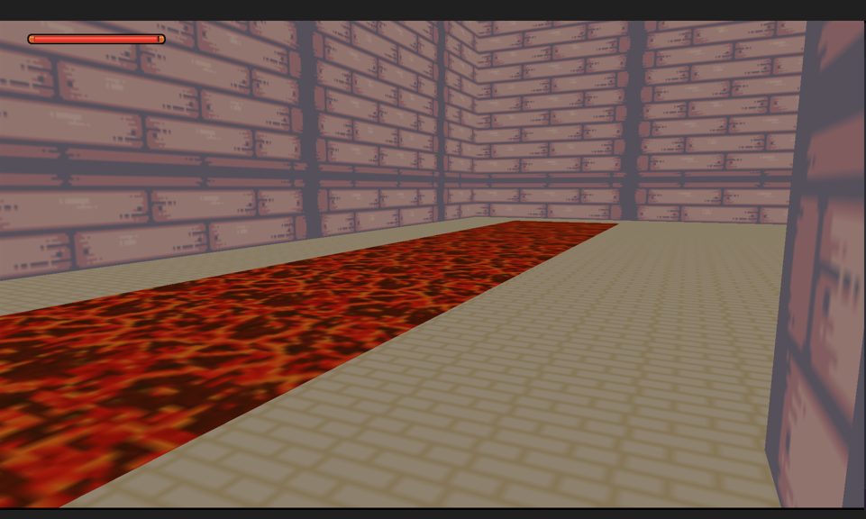
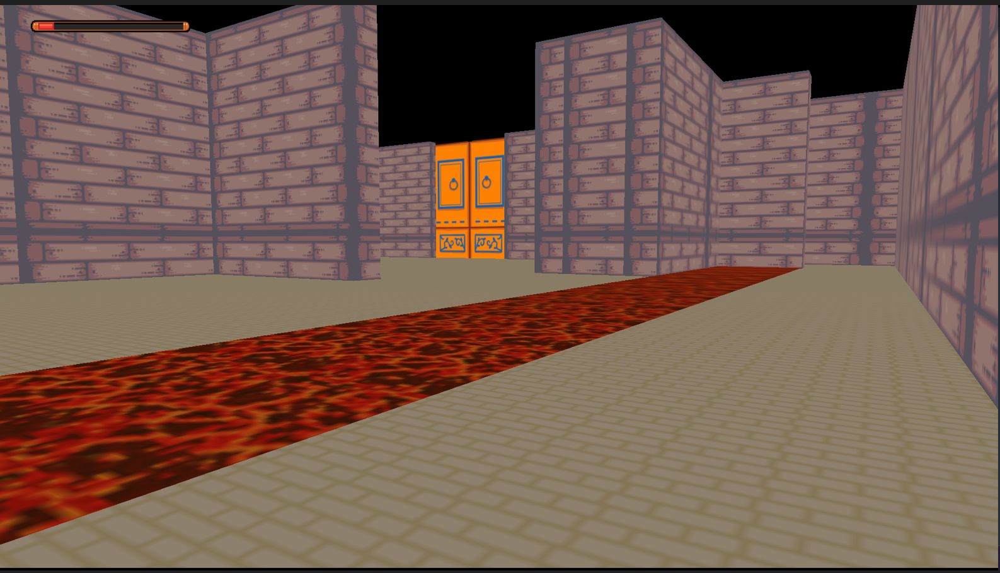

# A maze 

This is my first 3d Game, I develop it with Gdevelop. 

Gdvelop is known for an awesome 2d game development experience, but it could also be used for 3d Games with help of PANDAKO's extension.

--- 

Game logic: 

- Avoid  the lava 
- Avoid the Water
- Find the door 

--- 

If you touch the water or the lava more than 3 times, you will lose the game. 

-- 

## some images

--- 

try it here: https://mohmad-naser-alnakeshbandi.github.io/Amaze/

or on itch.io: https://mohmad-alnakeshbandi.itch.io/a-moz
